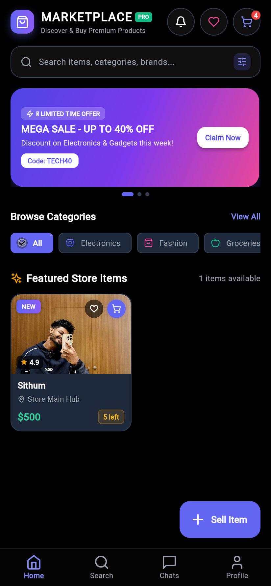
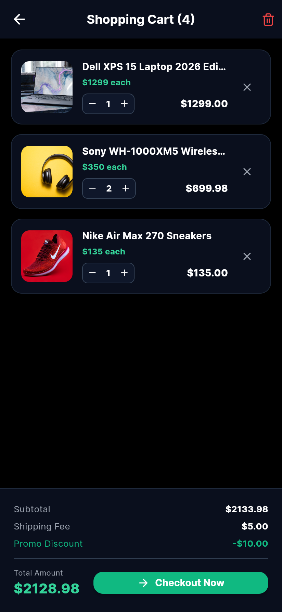
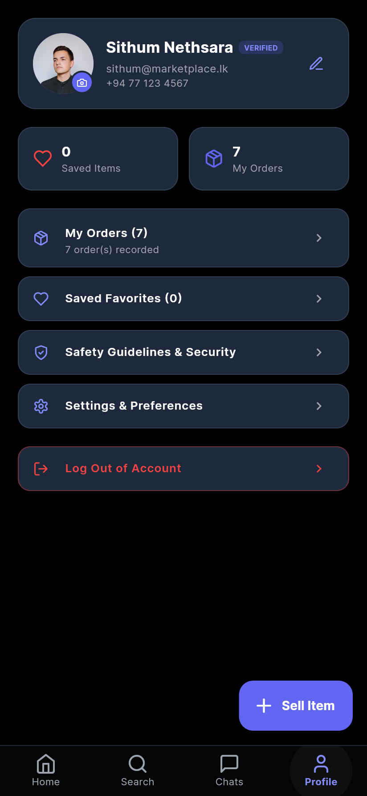
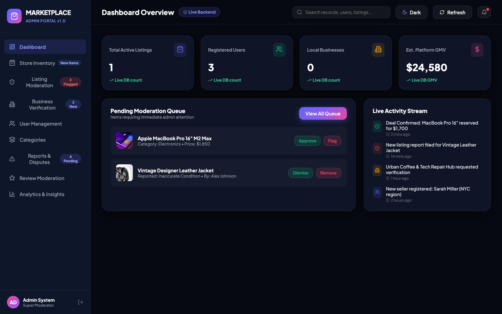
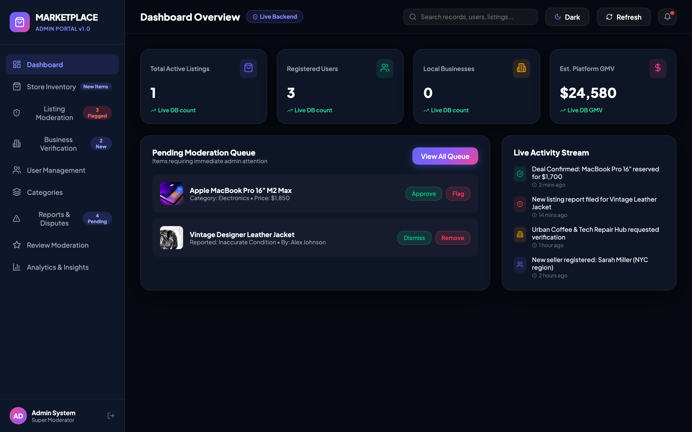
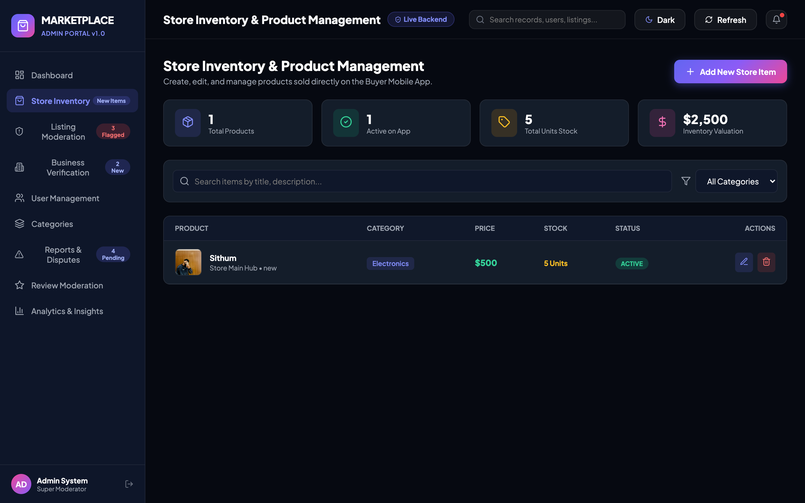
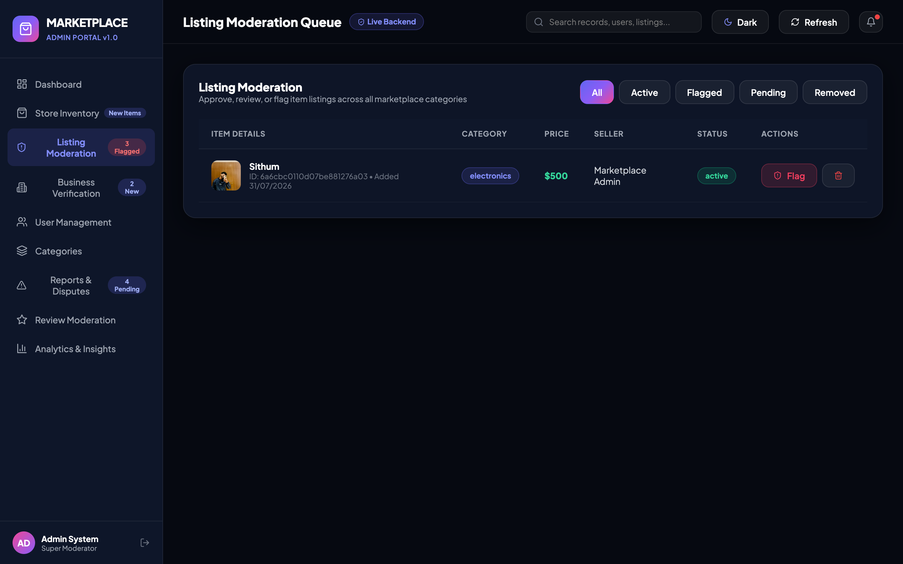
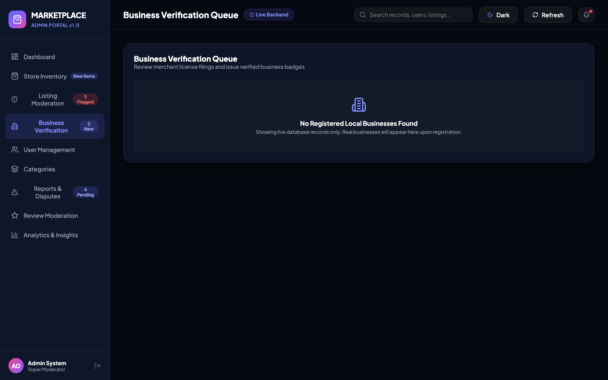

# 🛍️ MARKETPLACE MODULE MONOREPO


An enterprise-grade, full-stack **Marketplace Application Platform** engineered with a **Dual-Role Flutter Mobile Web App (Buyer & Seller)**, a **React Admin Moderation Dashboard**, and a **Node.js/Express + MongoDB + Socket.io Backend API Service**.

---

## 📸 Visual Showcase & UI Highlights

### 📱 1. Dual-Role Mobile Web App (`/mobile-app`)
Built with Flutter Web featuring AMOLED dark glassmorphism styling, real-time MongoDB item rendering, local cart persistence, and real-time chat.

| 🏠 Home Feed & Store Items | 🛒 Shopping Cart & Checkout |
| :---: | :---: |
|  |  |

| 👤 User Profile & Wallet |
| :---: |
|  |

---

### 🖥️ 2. Admin Moderation Web Panel (`/admin-panel`)
React 18 & Vite dashboard providing platform administrators with real-time KPI overview, CSV sales export, inventory management, and moderation queues.

| 📊 Admin Dashboard Overview | 📦 Customer Orders & Sales Queue |
| :---: | :---: |
|  |  |

| 🛍️ Store Inventory Management | 🛡️ Listing Moderation Queue |
| :---: | :---: |
|  |  |

| 🏢 Business Verification Queue |
| :---: |
|  |

---

## 🛠️ Architecture & Technology Stack

| Layer | Technologies & Tools |
| :--- | :--- |
| **Mobile Web App** | Flutter 3.x, Dart, Provider (State Management), Google Fonts, Lucide Icons, SharedPreferences JSON Caching |
| **Admin Panel** | React 18, Vite, CSS Glassmorphism, Lucide React Icons, Native Web Storage |
| **Backend Service** | Node.js, Express.js, Socket.io (Real-Time Communication), Mongoose (MongoDB ORM), JWT Authentication |
| **Database** | MongoDB (Geospatial 2dsphere indexing, Mongoose Schema validation) |

---

## ✨ Features & Capabilities

### 📱 1. Dual-Role Mobile App (`/mobile-app`)
- **🛍️ Store Listing Feed**: Dynamic category filtering (Electronics, Fashion, Groceries, Furniture, Vehicles, Business Directory), price tags, and store badges.
- **🛒 Persistent Shopping Cart**: Shopping cart items persist locally across page refreshes and browser restarts via `SharedPreferences` JSON storage & MongoDB synchronization.
- **➕ 5-Step Seller Listing Wizard**: Interactive multi-step form for creating product listings with live card preview.
- **💬 Real-Time Chat & Negotiation**: Interactive offer cards (`[Accept]`, `[Reject]`, `[Counter Offer]`) connected via Socket.io.
- **👤 Profile & Wallet**: Balance tracker, account details, saved favorites, and AMOLED dark theme toggle.

### 🖥️ 2. Admin Moderation Panel (`/admin-panel`)
- **📊 KPI Dashboard**: Live tracking for Active Listings, Registered Users, Platform GMV, and Pending Orders.
- **📥 CSV Report Exporter**: Download formatted CSV sales reports containing customer names, order IDs, product titles, pricing, and shipping addresses.
- **🛍️ Inventory Management**: Live stock count tracking and auto-deduction sync with customer orders.
- **🛡️ Listing & Review Moderation Queue**: Inspect, approve, flag, or remove reported listings and reviews.
- **🏢 Business Verification**: Verify business permits and award verified seller status badges.

### ⚙️ 3. Backend API & Real-time Engine (`/backend`)
- **Mongoose Models**: `User`, `Listing`, `Category`, `Business`, `BusinessReview`, `Chat`, `Message`, `Offer`, `Favorite`, `Report`, `Order`, `Transaction`.
- **Socket.io Handlers**: Live chat room join/leave events, instant messages, and real-time negotiation offers.
- **Geospatial & Filters**: MongoDB `$near` 2dsphere proximity search and price/condition query filters.

---

## 📂 Monorepo Folder Structure

```
MARKETPLACE MODULE/
├── admin-panel/           # React 18 + Vite Admin Moderation Panel
│   ├── dist/              # Production static web build
│   └── src/               # React components, pages & CSS
├── backend/               # Node.js + Express + Socket.io Server
│   └── src/               # Controllers, models, routes, sockets
├── mobile-app/            # Flutter Mobile & Web Client
│   ├── build/web/         # Production Flutter Web build
│   └── lib/               # Dart providers, models, screens, services
├── screenshots/           # Application screenshots for UI documentation
└── package.json           # Monorepo startup scripts
```

---

## 🚀 How to Run Locally

### 1. Install Dependencies
```bash
# Backend dependencies
cd backend && npm install

# Admin Panel dependencies
cd ../admin-panel && npm install

# Mobile App dependencies
cd ../mobile-app && flutter pub get
```

### 2. Environment Configuration
Create a `.env` file inside the `backend/` directory:
```env
PORT=5000
MONGODB_URI=mongodb://localhost:27017/marketplace_db
JWT_SECRET=marketplace_secret_jwt_key_2026
```

### 3. Start Services

- **Backend API & Socket Server** (Port 5000):
  ```bash
  cd backend && npm start
  ```

- **Admin Panel Dashboard** (Port 3001):
  ```bash
  cd admin-panel && npm run dev
  ```

- **Mobile Web App** (Port 3000):
  ```bash
  cd mobile-app
  flutter build web
  npx serve -s build/web -l 3000
  ```

---

## 🔌 API Endpoints Summary

| Method | Endpoint | Description |
| :--- | :--- | :--- |
| `GET` | `/api/listings` | Fetch active store item listings |
| `POST` | `/api/listings` | Create a new product listing |
| `GET` | `/api/orders` | Retrieve user/customer orders |
| `POST` | `/api/orders` | Create a new customer order and auto-deduct stock |
| `POST` | `/api/cart/sync` | Persist and synchronize shopping cart payload |
| `GET` | `/api/admin/dashboard-stats` | Get admin platform KPIs and counters |

---

## 📄 License
This project is proprietary software created for the Marketplace Module Platform.
